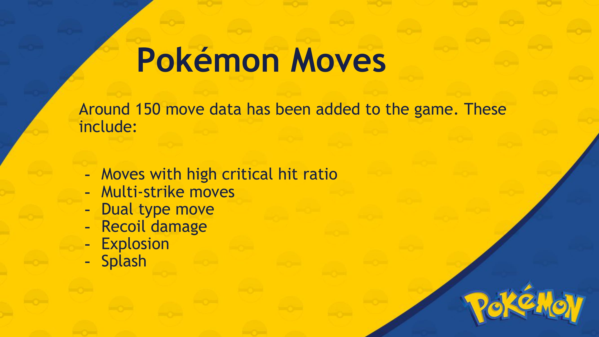
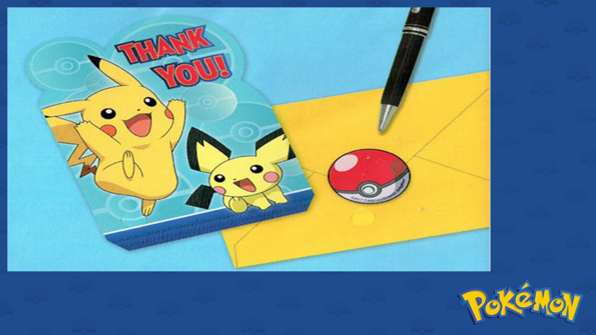

#Pokémon Mini BattleGround 
A two-player game that allows users to create a team of 6 Pokémon and battle against each other using turn based mechanics similar to those found in the Pokémon video game series. This project was made for the Structured Programming Lab during my 1st year of undergraduate program.

